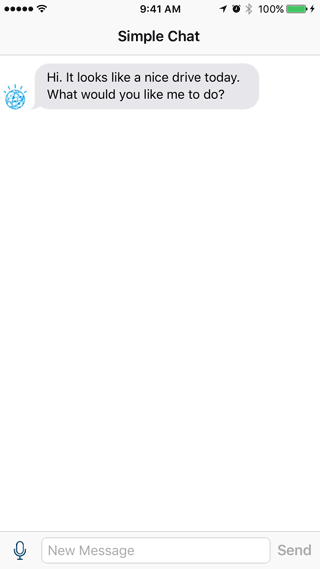

# Simple Chat (Swift)

This repository contains an example application to demonstrate the [Watson Developer Cloud Swift SDK](https://github.com/watson-developer-cloud/swift-sdk). It combines the [Speech to Text](https://www.ibm.com/watson/developercloud/speech-to-text.html), [Conversation](https://www.ibm.com/watson/developercloud/conversation.html), and [Text to Speech](https://www.ibm.com/watson/developercloud/text-to-speech.html) services to build a voice-to-voice chat app.



## Tutorial

If you'd prefer to learn by building this app yourself, feel free to follow along with the [tutorial](tutorial.md).

## Project Setup

To run the sample playground or iOS app, be sure to clone the repository and download the Watson Developer Cloud Swift SDK dependency. The dependency will be loaded twice, once as a Git submodule (for use in the playground) and again with Carthage (for use in the iOS app).

```bash
$ git clone https://github.com/watson-developer-cloud/simple-chat-swift.git
$ cd simple-chat-swift/simple-chat
$ git submodule init
$ git submodule update
$ carthage update --platform iOS
```

## Provision Services

The sample playground and iOS app both use the Speech to Text, Conversation, and Text to Speech services. Each service must be provisioned. You will need to [sign up for a Bluemix account](https://console.ng.bluemix.net/registration/) if you do not already have one.

To provision each service:

1. Open the [Bluemix services dashboard](https://console.ng.bluemix.net/dashboard/services).
2. Select the "Create Service" button.
3. Select the "Watson" category from the left-hand menu.
4. Select the service to provision.
5. Select "Create" to continue. (The default configuration options are fine for this tutorial.)

## Credentials

Each of the services you provisioned has its own username and password credentials. The playground and iOS app expect to find these credentials in a `Credentials.swift` file.

Start by renaming the `Credentials.swift.example` file in your project directory to `Credentials.swift`. Then open `Credentials.swift` in Xcode. This file will record our service credentials.

1. Open the [Bluemix services dashboard](https://console.ng.bluemix.net/dashboard/services).
2. Select the service whose credentials you would like to record.
3. Select "Service credentials" from the left-hand navigation menu.
4. Select "View credentials".
5. Copy the username and password into `Credentials.swift`.

Repeat these steps to copy the username and password credentials for the Speech to Text, Conversation, and Text to Speech services.

## Resources

Watson Developer Cloud:
- [Watson Developer Cloud](https://www.ibm.com/watson/developercloud/)
- [Watson Developer Cloud GitHub](https://github.com/watson-developer-cloud)
- [Watson Developer Cloud Swift SDK](https://github.com/watson-developer-cloud/swift-sdk)

Watson Swift SDK:
- [Readme](https://github.com/watson-developer-cloud/swift-sdk/blob/master/README.md)
- [Quick Start Guide](https://github.com/watson-developer-cloud/swift-sdk/blob/master/docs/quickstart.md)
- [Sample Apps](https://github.com/watson-developer-cloud/swift-sdk#sample-applications)
- [Documentation](http://watson-developer-cloud.github.io/swift-sdk/)

Swift@IBM:
- [Swift@IBM Developer Center](https://developer.ibm.com/swift/)
- [Kitura Developer Center](https://developer.ibm.com/swift/kitura/)
